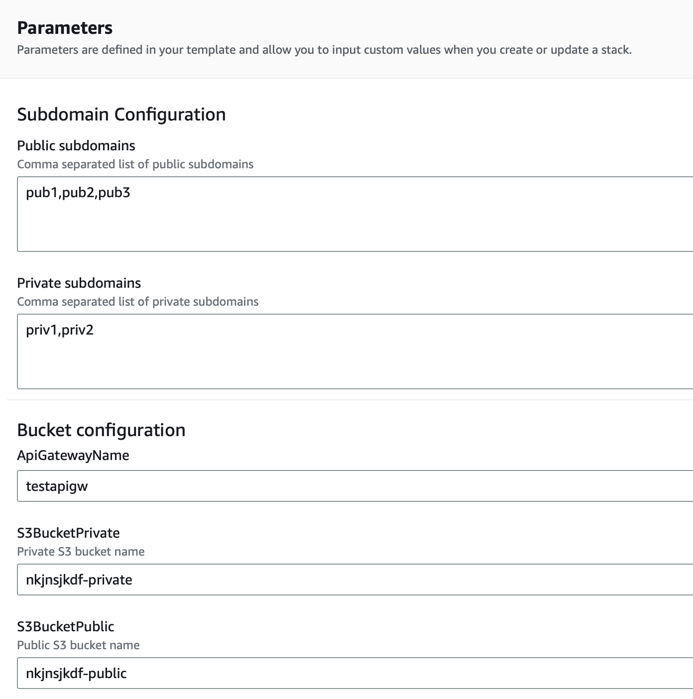
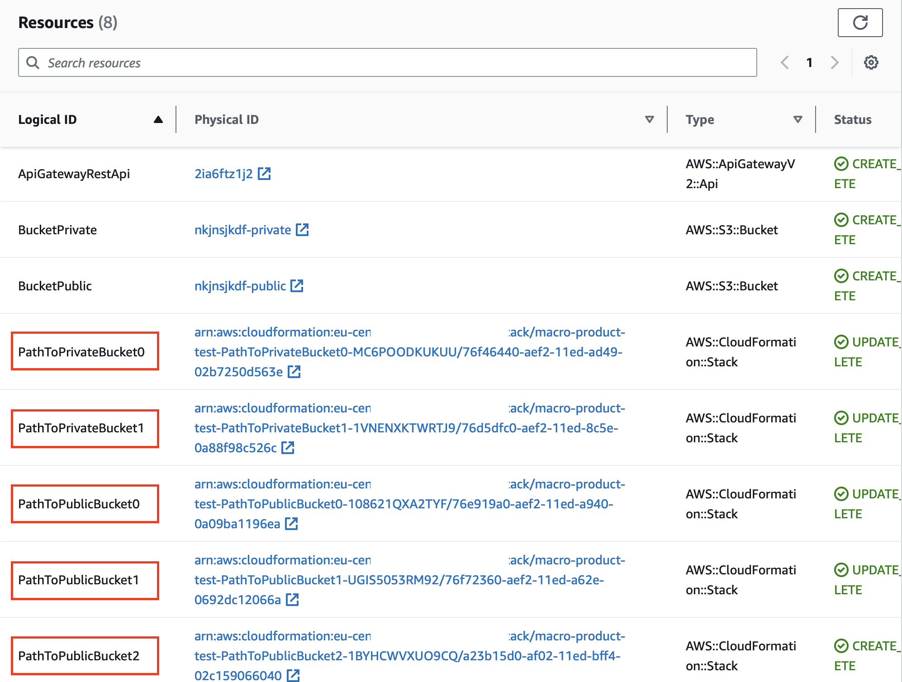
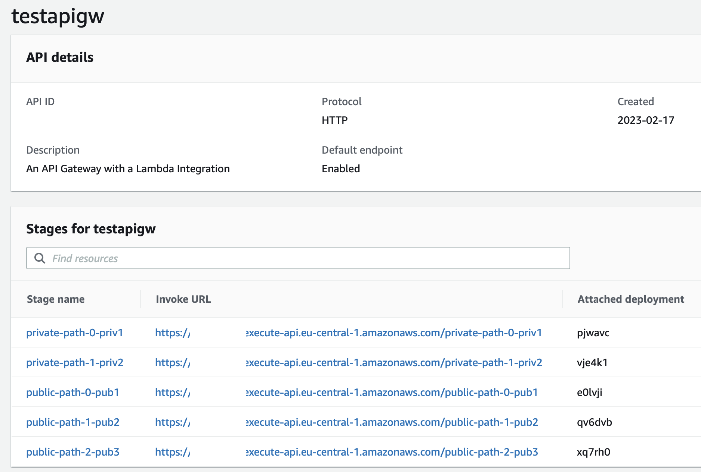

# ListForEach CloudFormation Macro

## About

This is a solution on how to create resources in a similar way as a for-loop in CloudFormation as this feature is missing. It is using a custom macro in order to work.

* It takes CommaDelimitedList as a parameter and creates resources (with access to both name and index) using a for-loop.



* All resources are created in CloudFormation with the index appended



* Each resource is built using the element and index from the list



## Example

An example which takes a list as a parameter:

```
AWSTemplateFormatVersion: "2010-09-09"
Transform: ListForEach
Parameters:
  PrivateSubdomains:
    Type: CommaDelimitedList
    Description: Comma separated list of private subdomains
    Default: "priv1,priv2"
Resources:
  PathToPublicBucket:
    Type: AWS::CloudFormation::Stack
    Properties:
      TemplateURL: https://some-bucket/cloudformation-manifest.yaml
      Parameters:
        PathName: "public-path-%d-%s"
        ApiGatewayRestApi: !Ref ApiGatewayRestApi
    ListForEach: !Ref PrivateSubdomains
Outputs:
  PathToPrivateBucketArn:
    Value: !Ref PathToPrivateBucket%d
    ListForEach: !Ref PrivateSubdomains
```

which will expand to the following before deploying:

```
AWSTemplateFormatVersion: "2010-09-09"
Parameters:
  PrivateSubdomains:
    Type: CommaDelimitedList
    Description: Comma separated list of private subdomains
    Default: "priv1,priv2"
Resources:
  PathToPublicBucket0:
    Type: AWS::CloudFormation::Stack
    Properties:
      TemplateURL: https://some-bucket/cloudformation-manifest.yaml
      Parameters:
        PathName: "public-path-0-priv1"
        ApiGatewayRestApi: !Ref ApiGatewayRestApi
  PathToPublicBucket1:
    Type: AWS::CloudFormation::Stack
    Properties:
      TemplateURL: https://some-bucket/cloudformation-manifest.yaml
      Parameters:
        PathName: "public-path-1-priv2"
        ApiGatewayRestApi: !Ref ApiGatewayRestApi
Outputs:
  PathToPrivateBucketArn0:
    Value: !Ref PathToPrivateBucket0
  PathToPrivateBucketArn1:
    Value: !Ref PathToPrivateBucket1
```

There is a more advanced example in `product.yaml`